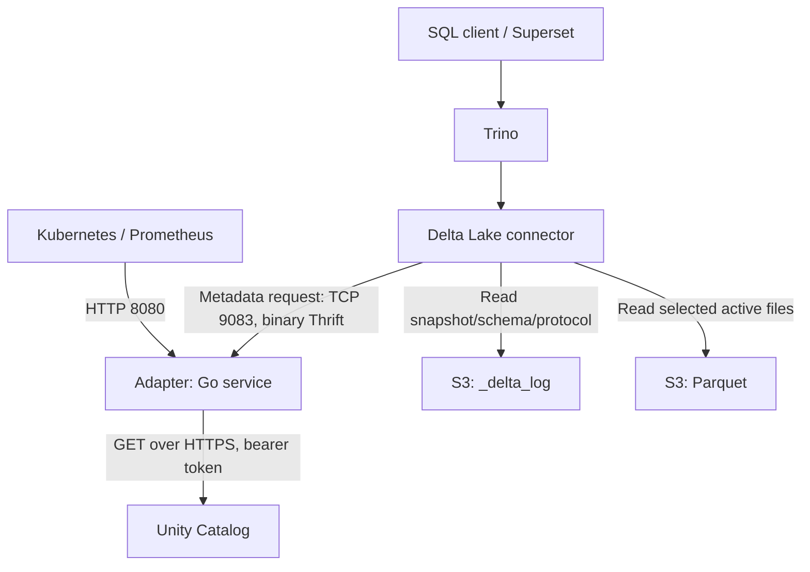

# UC–Trino Metastore Adapter: detailed code and teaching walkthrough

**Suggested teaching time: 60–90 minutes.** Source baseline: `5d47e413c439b584bd5a68ca8805982546a50e81`, reviewed 7 October 2026. [Short version](CODE_WALKTHROUGH_SHORT.md).

This guide explains the handwritten runtime code, generated protocol boundary, tests and deployment connectivity. Adapter behavior is grounded in the local source. Trino-side method chains follow the repository's [Trino 472 source-review notes](TRINO_CALL_FLOW.md); they are not observed runtime traces. The documented integration target is Trino 472 and OSS UC 0.5.1. Live Trino SQL acceptance and comparison with real HMS responses remain pending.

## 1. What problem does this solve?

Trino's Delta Lake connector needs a metastore to discover schema/table names and a table's storage location. Its Hive Metastore integration communicates using Thrift. Unity Catalog exposes catalog metadata using HTTP REST endpoints. The two systems use different protocols and different model names.

The adapter exposes a small HMS-compatible Thrift service and translates five read operations into UC GET operations. There is no HMS service or HMS database behind it. The authoritative catalog metadata comes from UC; actual Delta table schema and file membership come from the Delta log, which Trino reads.

An analogy: UC is the directory, the adapter translates directory questions, and Trino is the reader who visits the address and understands the files found there.

### Responsibility boundaries

| Component | Owns | Does not do in this design |
|---|---|---|
| SQL client / Superset | Submit SQL, display results; optionally discover schemas/tables/columns through Trino. | Call this adapter directly for ordinary SQL. |
| Trino | Parse/analyze SQL, resolve metadata, read Delta logs, plan and execute data scans. | Obtain S3 credentials from this adapter. |
| Adapter | HMS read contract, UC HTTP requests, validation, translation, bounded resource usage. | Read rows, interpret Delta logs, authorize individual SQL users or persist catalog metadata. |
| Unity Catalog | Return catalog schema/table metadata under the adapter credential's privileges. | Serve table rows through these GET endpoints. |
| Object storage | Store `_delta_log` and Parquet data files. | Answer HMS calls. |

### Two paths to draw on the board



The metadata response returns through adapter → Trino. Query rows return through Trino → client. A successful metadata lookup can still be followed by a storage permission failure or unsupported Delta reader feature.

## 2. Names and namespaces

Use this example throughout the lesson:

```text
Trino SQL name:     uc_delta.raw.events
Trino catalog:     uc_delta            (catalog file uc_delta.properties)
Adapter setting:   UC_CATALOG=unity
UC full table name: unity.raw.events
Storage location:  s3://example-bucket/raw/events/
```

The Trino catalog chooses the connector configuration. `UC_CATALOG` chooses the single UC namespace exposed by this adapter instance. HMS calls use database `raw` and table `events`; the adapter adds `unity` when constructing UC requests.

**UC schema maps to HMS database.** The HMS `get_all_databases` name is historical terminology. Here it lists UC schemas, not SQL databases hosted by another server.

One adapter configuration exposes one UC catalog. `GetTableReq` rejects any supplied HMS `CatName`, including an explicitly supplied empty value. That prevents a second, ambiguous catalog-selection mechanism.

Schema and table name validation preserves case and rejects empty names, surrounding whitespace, dots, ASCII spaces, `/`, `\`, control characters and HMS catalog markers `@`, `#`, `!`. UC responses must belong to the configured catalog and requested schema. Configuration's catalog validation is a separate, narrower check; do not assume all namespace validators enforce identical character rules.

## 3. Repository map: where each responsibility lives

| File/package | Responsibility | Start with these symbols |
|---|---|---|
| [cmd/server/main.go](../cmd/server/main.go) | Bootstrap, dependency wiring, listener startup, shutdown. | `main`, `run` |
| [internal/config/config.go](../internal/config/config.go) | Environment parsing, defaults, validation. | `Config`, `Load`, `load`, `Validate` |
| [internal/thrift/server.go](../internal/thrift/server.go) | TCP admission, binary protocol, request observation and draining. | `New`, `observedProcessor.Process`, `serverTransport.Accept`, `Shutdown` |
| [internal/thrift/handler.go](../internal/thrift/handler.go) | Five approved metadata RPCs and error mapping. | `Handler`, `metadataError` |
| [internal/thrift/generated/hms.go](../internal/thrift/generated/hms.go) | Generated structs, client, argument/result codecs and method processors. | `NewThriftHiveMetastoreProcessor` |
| [internal/unity/client.go](../internal/unity/client.go) | Authenticated bounded HTTP GETs. | `New`, `Get`, `get`, `attempt`, `retryable`, `configuredToken` |
| [internal/unity/pagination.go](../internal/unity/pagination.go) | Generic all-page aggregation. | `CollectPages[T]` |
| [internal/unity/schemas.go](../internal/unity/schemas.go) | UC schema model, exact lookup and list validation. | `SchemaInfo`, `ListSchemas`, `GetSchema` |
| [internal/unity/tables.go](../internal/unity/tables.go) | UC table model, eligibility and exact lookup/list. | `TableInfo`, `eligibleTable`, `ListTables`, `GetTable` |
| [internal/translate/schema.go](../internal/translate/schema.go) | Validated UC schema → HMS database. | `Database` |
| [internal/translate/table.go](../internal/translate/table.go) | Validated UC table → HMS table/list entry. | `Table`, `TableMeta` |
| [internal/observability/observability.go](../internal/observability/observability.go) | JSON logs, private Prometheus registry, health/version routes. | `NewLogger`, `NewMetrics`, `Health.Handler` |
| [internal/cache/doc.go](../internal/cache/doc.go) | Placeholder package comment. | No runtime cache implementation. |
| [scripts/generate-thrift.py](../scripts/generate-thrift.py) | Checksum-pinned IDL projection and reproducible generation. | `METHODS`, `main` |
| [integration](../integration/README.md) | Independent field-ID/wire-shape tests. | `wire_test.go`, `table_wire_test.go` |
| [deploy/kubernetes](../deploy/kubernetes/README.md) | Service, deployment, config and ingress policy. | `service.yaml`, `deployment.yaml`, `networkpolicy.yaml` |

Teach handwritten handlers before opening generated code. The generated file is large because every struct and method needs serialization machinery; it is not where business decisions are made.

## 4. Startup: exact construction chain

```text
OS starts executable
  → main()
      → observability.NewLogger(stdout, info)
      → config.Load()
          → load(os.LookupEnv)
          → Config.Validate()
      → NewLogger(stdout, configured level); slog.SetDefault()
      → signal.NotifyContext(background, SIGINT, SIGTERM)
      → run(ctx, cfg, logger)
          → observability.NewMetrics()
          → unity.New(cfg, metrics)
          → thrift.New(cfg, logger, metrics, uc)
          → Health.Handler(metrics)
          → net.Listen("tcp", HTTP address)
          → goroutine: thrift.Serve()
          → goroutine: httpServer.Serve(listener)
          → health.SetReady(true)
          → wait for cancellation or serving error
```

### Configuration loading

`load` reads strings, parses durations such as `3s`, integers and booleans, and converts the log level. Invalid values fail startup. Canonical deployment settings override legacy aliases even if the canonical value is empty; an invalid override does not quietly fall back.

| Canonical environment name | Legacy alias |
|---|---|
| `THRIFT_ADDR` | `THRIFT_ADDRESS` |
| `HTTP_ADDR` | `HTTP_ADDRESS` |
| `UC_CONNECT_TIMEOUT` | `HTTP_CONNECT_TIMEOUT` |
| `UC_REQUEST_TIMEOUT` | `HTTP_REQUEST_TIMEOUT` |

`Validate` requires the full UC base path `/api/2.1/unity-catalog`, HTTPS by default, one credential source, valid bind addresses and coherent positive budgets. Plain HTTP requires `UC_ALLOW_INSECURE_HTTP=true` for isolated local use. Bind port zero is allowed for tests.

### UC client construction

`unity.New` validates configuration again and checks that the configured token is locally available and syntactically usable. It creates a reusable `http.Client` and transport with connection limits, keepalive, connect/TLS timeouts and no automatic redirect following. It respects environment proxy configuration.

No request is made to prove that UC accepts the token. A readable token file and a valid-looking string are local checks only.

### Thrift server construction

`thrift.New` binds TCP synchronously. It creates a tracked transport, generated processor backed by `&Handler{UC: uc}`, and an `observedProcessor` wrapper. `NewTSimpleServer4` is configured with an ordinary transport factory and binary protocol. The service is **unframed binary Thrift over TCP**; the protocol configuration also bounds message sizes.

The default connection limit is 128. `serverTransport.Accept` closes excess accepted sockets and increments a rejection counter. Each admitted `trackedConn` is added to a synchronized map; its close callback removes it and decrements the connection gauge exactly once.

### HTTP server and readiness

The HTTP listener normally binds on 8080. Its timeouts and header limit bound probe/metrics HTTP resource usage. Both listeners must bind before readiness is set. If HTTP binding fails after Thrift binding, `run` shuts the Thrift server down.

The ready flag is atomic so concurrent HTTP handlers can read it safely. `/health/ready` does not query UC, check S3 or execute SQL.

## 5. Common request pipeline: wire bytes to Go methods

```text
Trino Thrift client serializes CALL(method, sequence ID, arguments)
  → accepted TCP socket
  → observedProcessor.Process(ctx, in, out)
      → ReadMessageBegin() → method name, message kind, sequence ID
      → context.WithTimeout(OperationTimeout)
      → ProcessorMap()[method name]
      → generated method.Process(ctx, sequence ID, in, out)
          → read typed argument struct
          → invoke Handler method
          → populate success field or declared exception field
          → write REPLY and flush
  → Trino decodes result
```

**RPC** means a remote procedure call: a client asks a server to run a named method with arguments. **Serialization** means turning typed values into wire bytes; **deserialization** reverses it. The sequence ID associates the reply with its request. Thrift fields also have numeric IDs so readers can recognize fields and skip unknown optional fields.

The wrapper starts the execution deadline after reading the message header. Idle header waiting is governed by the socket timeout instead. Default socket timeout and operation timeout are both 10 seconds, but they measure different things.

For a known `CALL`, the generated processor handles the method. For an unknown method, the wrapper consumes its argument struct using Apache's codec and returns `TApplicationException(UNKNOWN_METHOD)` with the original method name/sequence ID. An invalid message kind gets `INVALID_MESSAGE_TYPE_EXCEPTION`. It checks decoding/encoding errors rather than treating truncated input as success.

Only these five methods exist in the generated processor map:

```text
get_all_databases
get_database
get_table_meta
get_table_req
get_table
```

Unsupported reads and all mutations fail at the protocol boundary. A read-only HMS subset is not a generic Hive Metastore replacement.

## 6. Schema discovery: `SHOW SCHEMAS`

Repository-documented Trino path, simplified to the forwarding layers:

```text
SHOW SCHEMAS FROM uc_delta
  → SQL rewrite / information_schema
  → MetadataManager.listSchemaNames
  → DeltaLakeMetadata.listSchemaNames
  → DeltaLakeMetastore.getAllDatabases
  → cached HiveMetastore → BridgingHiveMetastore
  → ThriftHiveMetastore → ThriftHiveMetastoreClient
  → wire get_all_databases
```

Actual adapter chain:

```text
generated get_all_databases processor
  → Handler.GetAllDatabases(ctx)
  → UC.ListSchemas(ctx)
  → CollectPages[SchemaInfo](..., "schemas", ..., "schemas")
  → Client.get → Client.attempt
  → GET /schemas?catalog_name=unity&max_results=100
  → follow next_page_token
  → validate each schema + reject duplicate names
  → Handler copies SchemaInfo.Name into []string
  → Thrift response list<string>
```

`SchemaInfo` decodes only name, catalog, optional full name, comment and storage location. `validateSchema` checks the configured catalog and, when supplied, exact `full_name`. A wrong catalog or malformed identity is an error rather than silently disappearing from results.

An empty successful list is a real empty list. A malformed list or page failure is an error. Trino can add/filter built-in schema names, so the SQL result need not equal the wire list byte-for-byte.

### Exact schema lookup

`Handler.GetDatabase(ctx, "raw")` calls `UC.GetSchema`, which validates the input and GETs `schemas/unity.raw`. It validates returned identity and exact requested name, then calls `translate.Database`.

| UC schema field | HMS `Database` field |
|---|---|
| `name` | `Name` |
| `comment` | `Description` |
| `storage_location` | `LocationUri` |
| — | Empty non-null `Parameters` map |

Ownership, privileges, arbitrary properties and `storage_root` are not mapped. A schema storage root is not automatically a database location. Ordinary Trino schema existence checks use schema listing according to the repository's pinned source review; do not claim each `SHOW TABLES` needs `get_database`.

## 7. Table discovery: `SHOW TABLES`

Trino's documented table-list path ends in `get_table_meta("raw", "*", [])`. Schema existence checks may run first and caches can change observed calls.

```text
Handler.GetTableMeta(ctx, "raw", "*", types)
  → reject broader schema patterns or a table pattern other than "*"
  → UC.ListTables(ctx, "raw")
      → validate schema input
      → CollectPages[TableInfo]
      → GET /tables?catalog_name=unity&schema_name=raw&max_results=50
      → validate identity/type/format for every item
      → reject duplicate names
      → retain eligible external Delta tables
  → apply HMS table-type filter
  → translate.TableMeta for each included table
  → return list<TableMeta>
```

`TableMeta` is a lightweight listing entry: database name, table name, `EXTERNAL_TABLE` type and optional comment. Table listing does not make an additional UC GET per table.

An empty type list or one containing `EXTERNAL_TABLE` includes eligible tables. Other type filters yield an empty list **after** the UC lookup succeeds. This ordering means an upstream failure is not disguised as an empty answer just because the filter excludes the results.

### Eligibility versus corruption

`eligibleTable` validates identity before filtering. Known `MANAGED` tables, recognized views and recognized non-Delta formats are excluded from a list; direct lookup rejects them as unsupported. Unknown table types/formats, inconsistent identities and invalid external Delta locations fail the operation.

Eligible tables require:

1. Matching UC catalog/schema and a valid table name.
2. `table_type == "EXTERNAL"`.
3. `data_source_format == "DELTA"`.
4. No nonempty `view_definition`.
5. An `s3` or `s3a` location with a bucket matching the implemented bucket-name expression, and no user credentials, port, query, fragment or control characters.

The original location is preserved. Spaces, URI escapes and a trailing slash are not normalized away. The adapter validates the location string; it does not contact the bucket or prove that the path contains Delta data.

`ListTables` treats a first-page HTTP 404 with UC code `SCHEMA_NOT_FOUND` as an empty table list. A later-page error is wrapped as `pagination_failed`, so it cannot erase already collected pages and turn the whole operation into successful emptiness.

## 8. Exact table lookup and HMS translation

The modern request accepts a structured HMS `GetTableRequest`:

```text
Handler.GetTableReq(ctx, req)
  → reject nil request
  → reject req.CatName != nil
  → Handler.GetTable(ctx, req.DbName, req.TblName)
      → UC.GetTable(ctx, schema, name)
          → validate names
          → Client.Get("tables/" + PathEscape("unity.raw.events"))
          → validate eligibility and returned exact name
      → translate.Table(*table)
  → GetTableResult_{Table: table}
```

The older `get_table` method directly uses the shared `Handler.GetTable`. Shared lookup and translation keep their success/error behavior aligned. Trino capabilities carried in the modern request do not cause a different mapping.

### Concrete before/after example

Illustrative UC response, not captured production traffic:

```json
{
  "name": "events",
  "catalog_name": "unity",
  "schema_name": "raw",
  "table_type": "EXTERNAL",
  "data_source_format": "DELTA",
  "storage_location": "s3://example-bucket/raw/events/",
  "comment": "Example events"
}
```

The essential HMS result is:

```text
Table
  tableName = "events"
  dbName = "raw"
  tableType = "EXTERNAL_TABLE"
  parameters = {"spark.sql.sources.provider": "DELTA"}
  partitionKeys = []
  sd (StorageDescriptor)
    cols = []
    location = "s3://example-bucket/raw/events/"
    serdeInfo
      name = "events"
      parameters = {"path": "s3://example-bucket/raw/events/"}
    bucketCols = []
    sortCols = []
    parameters = {}
```

**StorageDescriptor (`sd`)** is the HMS structure describing physical storage. **SerDe** means serializer/deserializer; the existing HMS shape has a SerDe structure, whose `path` parameter is consumed by the pinned Trino Delta conversion. The adapter supplies the shape Trino expects; it does not install or run a SerDe implementation.

The two location fields are intentional. The repository's Trino source notes identify `sd.serdeInfo.parameters["path"]` as the location extracted during Delta conversion. Supplying only a plausible HMS location can therefore be insufficient for the target path.

`sd.cols` and `partitionKeys` are explicit non-null empty collections. UC columns/properties are not decoded into `TableInfo` and cannot overwrite provider/path. The table detail translation does not copy the UC comment into a table parameter; list entries do carry it. Actual table metadata, including columns and Delta table properties, is read later by Trino from the log.

## 9. After the adapter returns: Delta and data execution

This part executes in Trino, outside the adapter. It follows [the repository's source-derived native data path](TRINO_CALL_FLOW.md#native-data-path).

```text
HMS result received
  → HiveMetastoreBackedDeltaLakeMetastore.convertToDeltaMetastoreTable
  → DeltaLakeMetadata.getTableHandle
      → obtain table path
      → TransactionLogAccess.loadSnapshot
      → metadata/protocol entries + supported reader checks
      → construct Delta table handle
  → getTableMetadata / getColumnHandles
  → query optimization, predicates and statistics
  → DeltaLakeSplitManager.getSplits
      → TransactionLogAccess.getActiveFiles
      → partition/file predicates
      → generate splits
  → DeltaLakePageSourceProvider.createPageSource
      → applicable column mapping/deletion-vector handling
      → ParquetPageSourceFactory.createPageSource
  → worker execution → result rows → client
```

A **snapshot** is the table state at a Delta version, reconstructed from log/checkpoint information. A **protocol entry** specifies the reader capabilities required. A **table handle** carries resolved table information inside Trino. A **split** is a unit of scan work scheduled for execution. A **page source** produces batches of data for the execution engine.

### What common SQL operations need

| SQL operation | Catalog work | Work after catalog lookup |
|---|---|---|
| `SHOW SCHEMAS` | Schema list. | No Delta log read required. |
| `SHOW TABLES` | Schema checks and table list as needed. | No full table-schema scan is inherently required. |
| `DESCRIBE table` | Table/view resolution and table lookup. | Delta metadata/protocol supply actual columns. |
| `SHOW CREATE TABLE` | Table resolution. | Reconstruct definition using Delta metadata/properties. |
| `SELECT *` | Resolve table location. | Snapshot → active files → splits → data reader. |
| `SELECT count(*)` | Same table-resolution path. | May use file row-count statistics when applicable, otherwise read files. The adapter never computes row count. |
| Partition-filtered `SELECT` | Same table-resolution path. | Use Delta partition values and predicates to prune active files; no HMS partition RPC needed. |
| `information_schema.columns` | May list tables then resolve each table. | Delta log reads per table can be expensive; Trino can omit failed entries in tolerant listing paths. |
| Time travel | Same location lookup. | Requested version influences snapshot loading; retained logs/checkpoints must be available. |

Trino's per-transaction/shared caches can avoid repeated requests. The adapter itself has no metadata cache: `CACHE_TTL` must remain `0s`. Therefore a diagram of forwarding layers does not imply one HTTP call per SQL statement.

For Superset, discovery typically passes through its engine spec, SQLAlchemy inspector and Trino driver to `information_schema` queries. Columns still ultimately require Delta metadata. The exact deployed Superset/plugin behavior must be verified separately; the reference versions and chains are recorded in `TRINO_CALL_FLOW.md`.

## 10. HTTP client: authentication, deadlines and retries

### `Get` → `get` → `attempt`

`Get` establishes an operation deadline and calls private `get`. `get` rejects absolute URLs, hosts, credentials, query/fragment-bearing resource strings and escaping/dot path components. Query parameters are passed separately through `url.Values`, then encoded. These checks keep requests relative to the configured UC API base.

`attempt` obtains a token, creates a context-bound HTTP GET, sets `Authorization: Bearer <token>` and `Accept: application/json`, sends it and reads the bounded body. Only HTTP 200 is success. Other statuses preserve structured UC error code/message internally; non-JSON proxy responses remain HTTP failures.

`Error.Error()` exposes a compact kind/status rather than the untrusted upstream message. `metadataError` later produces bounded client-facing HMS messages. Credentials are not logged.

### Two credential modes

| Source | Behavior | Rotation consequence |
|---|---|---|
| `UC_TOKEN` | Loaded into config at startup. | Restart the process/pods after changing the Secret. |
| `UC_TOKEN_FILE` | Opened/read for every HTTP attempt, including retries. | Updated readable file contents can be used by later attempts. |

Tokens are limited to 16 KiB, trimmed at the edges and rejected if empty or containing internal whitespace/control separators covered by the token validator. Exactly one source is required. The bundled Kubernetes deployment uses an environment Secret reference, not a mounted file.

### Timeout hierarchy and defaults

| Budget | Default | Meaning |
|---|---|---|
| `UC_CONNECT_TIMEOUT` | 1s | Connect and TLS handshake timeout configuration. |
| `UC_REQUEST_TIMEOUT` | 3s | Full HTTP attempt timeout; transport header timeout also configured. |
| `UC_OPERATION_TIMEOUT` | 10s | Overall GET/list/RPC execution budget through context propagation. |
| `THRIFT_SOCKET_TIMEOUT` | 10s | Socket read/write timeout, including idle protocol waits. |
| `SHUTDOWN_TIMEOUT` | 15s | Drain budget before forcing remaining sockets closed. |

Connect ≤ request ≤ operation is enforced. Nested contexts inherit earlier deadlines, so retries and list pages do not each receive a fresh unlimited overall budget.

### Retry rules

`retryable` allows transport errors and HTTP 429/500/502/503/504. Certificate validation errors, ordinary 401/403/404 and invalid JSON are not retryable by these rules.

Default maximum attempts is two, including the initial attempt. Backoff starts at 100ms, grows exponentially up to 1s and uses equal jitter: a randomized wait between roughly half and all of the current delay. This reduces synchronized retry bursts. `Retry-After` can increase the wait beyond the backoff cap, but a wait that cannot fit in the remaining deadline is not started. Context cancellation interrupts waiting.

HTTPS certificate verification remains enabled. Redirects are not followed; an HTTP 3xx response becomes a failure rather than sending the token to a redirected endpoint.

## 11. Pagination: why the generic collector exists

UC list APIs return an envelope containing a collection and possibly `next_page_token`. `CollectPages[T]` is generic Go code reused for `SchemaInfo` and `TableInfo`.

```text
copy query parameters; start operation context
  → GET current page
  → require a non-null collection
  → check aggregate encoded collection/token byte budget
  → decode items; check aggregate item count
  → append to local result
  → decode next token
      → empty: return complete result
      → repeated: fail with pagination_cycle
      → new: set page_token and continue
  → page cap exceeded: fail with pagination_limit
```

Defaults are 4 MiB per HTTP response, 16 MiB of accumulated collection/token JSON bytes, 1,000 pages and 100,000 items. The list-byte budget is not a bound on every byte of Go heap usage; decoded objects and maps also consume memory.

The collector returns no partial result when a page fails. Resource-specific code then validates identities and rejects duplicate schema/table names. A continuation-token cycle and a duplicate object identity are different failures and are checked separately.

Teaching example: if page one lists 50 tables and page two times out, returning those 50 would falsely suggest a complete directory. The implementation returns an error instead.

## 12. Error translation and absence semantics

`metadataError` translates Go context/network/UC errors into declared HMS exceptions.

| Condition | HMS result |
|---|---|
| Deadline/network timeout | `MetaException`: `UC_TIMEOUT` |
| Context cancellation | `MetaException`: `UC_CANCELED` |
| Invalid input schema/table name | `MetaException`: `INVALID_SCHEMA_NAME` / `INVALID_TABLE_NAME` |
| Known ineligible table on exact lookup | `MetaException`: `UNSUPPORTED_TABLE` |
| Invalid/oversize UC response | `MetaException`: `UC_INVALID_RESPONSE` |
| Page failure/cycle/duplicate/limit | `MetaException`: `UC_LIST_FAILED` |
| Token unavailable/invalid, HTTP 401 | `MetaException`: `UC_AUTHENTICATION_FAILED` |
| HTTP 403 | `MetaException`: `UC_AUTHORIZATION_FAILED` |
| Certificate failure or non-object 404 | `MetaException`: `UC_CONFIGURATION_ERROR` |
| HTTP 409 | `MetaException`: `UC_CONFLICT` |
| HTTP 429 after retry handling | `MetaException`: `UC_THROTTLED` |
| Other failures | `MetaException`: `UC_UNAVAILABLE` |
| Confirmed exact schema absence | `NoSuchObjectException`: `UC_SCHEMA_NOT_FOUND` |
| Confirmed exact table/schema absence during table lookup | `NoSuchObjectException`: `UC_TABLE_NOT_FOUND` |
| Unsupported wire method | `TApplicationException(UNKNOWN_METHOD)` |

The 404 absence rule requires both HTTP 404 and the matching structured UC code. During table lookup, `TABLE_NOT_FOUND` or `SCHEMA_NOT_FOUND` confirms absence. A catalog, proxy or route 404 does not. This is **fail closed** behavior: uncertainty becomes an error rather than a misleading empty/absent response.

An HMS `MetaException` is a declared method-level metadata error. A `TApplicationException` is a protocol/service-level error such as an unknown method. They occupy different wire result paths.

## 13. Connectivity and deployment: explain each hop

### Trino configuration

Save the following as `uc_delta.properties` in the deployment's Trino catalog configuration:

```properties
connector.name=delta_lake
hive.metastore.uri=thrift://uc-trino-metastore:9083
hive.metastore.thrift.impersonation.enabled=false
delta.metastore.store-table-metadata=false
delta.security=READ_ONLY
```

| Setting | Why it matters |
|---|---|
| `connector.name=delta_lake` | Selects Trino's native Delta implementation. |
| `hive.metastore.uri` | Directs its HMS metadata traffic to the adapter service. |
| Impersonation false | Avoids unsupported HMS end-user impersonation behavior. |
| Store-table-metadata false | Prevents optional Delta metadata caching writes to the read-only metastore. |
| Delta security read-only | Restricts connector write operations; preserve additional deployment governance. |

Leave HMS catalog-name unset because the adapter uses `UC_CATALOG`. Leave `delta.hive-catalog-name` unset to avoid redirecting a non-Delta lookup to another Hive catalog. Configure Trino's existing S3 access separately; the adapter cannot make an inaccessible Delta path readable.

### Adapter environment

```text
UC_BASE_URL=https://uc.example/api/2.1/unity-catalog
UC_CATALOG=unity
UC_TOKEN_FILE=/absolute/path/to/uc-token
THRIFT_ADDR=:9083
HTTP_ADDR=:8080
LOG_LEVEL=info
```

For all supported settings and limits, see [README configuration](../README.md#configuration). Provision a token securely; do not place a real credential in this document, a source file, image build argument or command-line literal.

### Network and identity matrix

| Hop | Protocol / destination | Credential / access requirement | Failure examples |
|---|---|---|---|
| Client → Trino | Deployment's SQL HTTP(S) endpoint | Existing Trino client authentication/authorization. | Trino login or SQL privilege denial. |
| Trino → adapter | Unframed binary Thrift, TCP 9083 | Network reachability; no adapter HMS TLS/SASL/user auth implemented. | DNS failure, denied TCP, socket timeout, unsupported RPC. |
| Adapter → UC | HTTPS API base; commonly port 443, URL may specify another | Adapter UC bearer token plus valid trusted TLS. | 401, 403, timeout, invalid certificate, wrong API base. |
| Trino → storage | Trino's configured S3 endpoint/access | Trino storage credentials and appropriate object permissions. | Cannot read log/files, missing object, unsupported Delta features. |
| Probes/Prometheus → adapter | HTTP TCP 8080 | Allowed network access. | Probe or scrape timeout. |

The adapter uses one configured UC credential; it does not forward each SQL user's identity. UC checks are therefore made for that service credential. Keep SQL-user governance and object-storage permissions explicit when explaining security.

### Kubernetes objects

`service.yaml` creates ClusterIP service `uc-trino-metastore`, selecting adapter pods and exposing named ports `thrift:9083` and `http:8080`. The Deployment is named `uc-trino-metastore-adapter`; the different service name is intentional.

Same namespace DNS can use `uc-trino-metastore`. Across namespaces, use `uc-trino-metastore.uc-poc.svc.cluster.local` with the correct namespace/cluster domain for the environment.

`deployment.yaml` runs one POC replica as UID/GID 65532 with a read-only root filesystem, dropped capabilities and no service-account-token mount. Settings come from two ConfigMaps; `UC_TOKEN` comes from Secret `uc-adapter-token`. Readiness and liveness probe the HTTP routes. Kubernetes allows 30 seconds for termination while the service's default drain budget is 15 seconds.

The supplied `networkpolicy.yaml` is **Ingress-only**. It permits same-namespace pods labeled as Trino on 9083 and Prometheus on 8080. It does not itself define egress access to UC. Cross-namespace clients require adjusted selectors, and other cluster policies/CNI behavior can affect connectivity. Plain Thrift is intended to remain cluster-internal; broader exposure requires validated transport protection.

### Build/package ownership

`Makefile` builds a static Go binary from `./cmd/server` and injects version/revision/build timestamp through linker flags. `Dockerfile` uses a pinned Go build stage and a `scratch` runtime containing only the binary and CA certificates, running as a non-root user. Go module/toolchain declarations pin Go 1.27.0 / toolchain 1.27.1; the README directs builds to 1.27.1.

The repository assigns image build, push, deployment and smoke tests to a separate build/deployment system. This walkthrough does not perform those operations. That system should use the approved exact commit and immutable image reference, following [BUILD_AND_DEPLOY.md](BUILD_AND_DEPLOY.md).

## 14. Observability and shutdown

### Routes

| Route | What it proves |
|---|---|
| `/health/live` | HTTP handler responds while process/server is serving. |
| `/health/ready` | Local initialization and listener setup reached ready state. |
| `/metrics` | Prometheus counters, gauges and histograms are exposed. |
| `/version` | Service/build/runtime identity, including git SHA. |
| `/livez`, `/readyz` | Retained health aliases. |

### Metrics and their interpretation

`adapter_requests_total` tracks known RPC labels and processor outcome; unknown method names collapse to `unknown` to bound label cardinality. `adapter_request_duration_seconds` measures processor duration. UC metrics measure individual HTTP attempts/statuses, latency and retry count. Connection gauges/counters record active/rejected sockets. The registry also includes Go/process collectors.

**Cardinality** means the number of distinct label combinations. Arbitrary table names, user IDs, tokens or unknown RPC names would create unbounded combinations; the implementation avoids these labels.

There is a useful distinction in RPC status interpretation: generated processors can successfully serialize a declared `MetaException` while returning no processor-level exception. The wrapper can consequently label that exchange `success`. Treat this as processor/protocol outcome, not proof that metadata retrieval succeeded; inspect UC status metrics and returned exceptions too.

JSON `slog` logging provides startup/drain records and debug request observations. It does not log the entire configuration or bearer token.

### Shutdown chain

```text
SIGTERM / SIGINT or a serving error
  → run's wait ends
  → health.SetReady(false)
  → create ShutdownTimeout context
  → start Thrift shutdown concurrently
  → httpServer.Shutdown(ctx), force Close on error
  → Thrift stops accepts and drains
  → deadline forces tracked sockets closed if needed
  → normalize ordinary server/listener-close errors
  → return joined errors
  → deferred UC.Close releases idle HTTP connections
```

`sync.Once` prevents repeating the server stop sequence. Tracked sockets let shutdown close idle or stuck connections. A Thrift drain deadline triggers a warning and is normalized in `run`; other shutdown failures can still cause a nonzero exit.

## 15. Generated code and interoperability contract

The unchanged source IDL comes from checksum-pinned `trinodb/hive-thrift` tag 2, the client artifact version documented for Trino 472. Artifact tag 2 is not a claim that this service implements Hive server version 2.

`scripts/generate-thrift.py`:

1. Verifies the source SHA-256.
2. Selects the five approved method signatures.
3. Includes their transitively referenced structs/enums/exceptions.
4. Omits optional `StorageDescriptor` field 11, `skewedInfo`, because its map with list keys cannot be represented as Go map keys.
5. Requires Thrift compiler 0.24.0 and generates/formats Go bindings.
6. Writes derived IDL/Go output or compares it with checked-in files under `--check`.

Retained wire field IDs, types and exception slots matter more than Go spelling. Unknown optional fields can be skipped; independent wire tests exercise the original skew field. This is a deliberately narrow external-Delta model, not arbitrary Hive skew-table support.

Normal builds use checked-in generated Go and do not need a Thrift compiler. Regeneration uses `make generate`; reproducibility verification uses `make check-generated`. Do not hand-edit generated Go or the derived IDL. See [wire provenance](../third_party/hive-thrift/README.md).

## 16. Tests: what to show and what they prove

| Area | Useful tests/files | Evidence provided |
|---|---|---|
| Config | `internal/config/config_test.go`: `TestLoad`, `TestDeploymentEnvironment` | Parsing, validation and deployment settings. |
| HTTP | `internal/unity/client_test.go`: auth/rotation, retries, response limits, redirects, TLS, timeout/cancellation | Client behavior under controlled HTTP servers. |
| Pagination | `TestPagination`, `TestPaginationByteLimit`, schema/table list tests | Page following, bounds, cycles/failures and complete-result rules. |
| Schema/table validation | `schemas_test.go`, `tables_test.go` | Identity, exact lookup, name validation, table eligibility and URI behavior. |
| Translation | `internal/translate/*_test.go` | HMS field mapping, empty collections and golden table shape. |
| Real TCP contract | `internal/thrift/schema_test.go`, `table_test.go` | Supported RPCs against adapter sockets and controlled UC responses. |
| Unsupported methods | `TestEveryOtherIDLMethodRejected` | Non-allowlisted upstream methods cannot succeed. |
| Transport/lifecycle | `server_test.go`, `cmd/server/main_test.go` | Admission limit, malformed input, idle shutdown and startup/lifecycle behavior. |
| Independent wire fixtures | `integration/wire_test.go`, `table_wire_test.go` | Field IDs, optional-field skipping and table containers/provider/path. |
| Health/logs/version | `internal/observability/observability_test.go` | Probe responses and observability shape. |

Golden fixtures are labeled synthetic, not captured from a real HMS. Go TCP/wire tests do not certify Trino Java client conversion or working live SQL.

Repository check commands for the separate build/test environment:

```sh
go test ./...
make check
make race
make check-generated
```

`make check` runs vet/tests and checks Go formatting. `make race` runs tests with the race detector. `make check-generated` additionally needs the pinned Thrift compiler and Python. These commands are documented here; this documentation task does not claim a fresh runtime/build validation.

## 17. Teaching session and acceptance demo

### Suggested lesson sequence

| Time | Topic | Learner should be able to explain |
|---|---|---|
| 0–10 min | Draw metadata/data paths; define terms. | Why the adapter exists and where rows flow. |
| 10–20 min | Names, config and `main.go`. | How `uc_delta` maps to `unity`, and how the service starts. |
| 20–35 min | Thrift dispatch and schema/table handlers. | The exact Go chain for each of the five RPCs. |
| 35–45 min | UC HTTP/pagination/error code. | Why retries are bounded and partial lists fail. |
| 45–55 min | Table translation and Delta continuation. | Why columns are empty and why provider/path are essential. |
| 55–65 min | Connectivity, credentials, probes and tests. | How to separate catalog, protocol and storage failures. |
| 65–90 min | Questions and environment-dependent demo. | Trace one query and interpret failure points. |

### Proposed runtime demo

First establish service identity and local readiness:

```sh
curl --fail http://127.0.0.1:8080/version
curl --fail http://127.0.0.1:8080/health/ready
curl --fail http://127.0.0.1:8080/metrics
```

These addresses assume local exposure/port-forwarding already exists. Then use a real external Delta fixture:

```sql
SHOW SCHEMAS FROM uc_delta;
SHOW TABLES FROM uc_delta.raw;
DESCRIBE uc_delta.raw.events;
SHOW CREATE TABLE uc_delta.raw.events;
SELECT * FROM uc_delta.raw.events LIMIT 10;
SELECT count(*) FROM uc_delta.raw.events;
```

Explain what each step adds: schema listing checks the metadata path; table listing adds eligibility; `DESCRIBE` adds native Delta metadata reading; `SELECT` adds execution/storage access. Run controlled failure cases only in a suitable test environment. Runtime acceptance must verify no real HMS is configured/reachable, upstream failures propagate, and the actual Trino deployment works with its chosen Delta fixture.

### Troubleshooting by the last successful boundary

| Observation | Investigate next |
|---|---|
| Ready endpoint is healthy, but `SHOW SCHEMAS` fails | Trino→adapter DNS/TCP/protocol, then adapter→UC URL/TLS/token and exceptions. |
| Schemas list but a table does not appear | UC catalog/schema, table type/format, list pagination and validation. |
| Table lookup succeeds but `DESCRIBE` fails | Returned path, Trino storage permissions, Delta log existence and supported protocol/features. |
| `DESCRIBE` works but `SELECT` fails | Active data files, worker storage connectivity/permissions and native reader/execution errors. |
| `information_schema.columns` is incomplete | Per-table Delta/metadata failures may be swallowed by tolerant Trino paths; inspect exact table operations. |
| A new HMS RPC returns unknown method | The five-method contract does not cover that path; review Trino version/settings before extending it. |

### Questions with model answers

**Why not query UC columns to answer `DESCRIBE`?** The native Delta log is the schema source for the pinned connector path. The adapter intentionally returns empty HMS column lists and lets Trino interpret Delta metadata.

**Why is the same path placed in two fields?** HMS has a storage location field, while the pinned Trino Delta conversion consumes the SerDe `path` parameter. Both are supplied consistently.

**Can the UC token read S3 data?** This adapter only uses it for UC REST. Trino needs its own storage access; no credential exchange or vending is implemented.

**Does a ready pod prove UC authorization works?** No. Readiness checks local setup and listeners, not acceptance of the credential by UC or a working Delta scan.

**Does the adapter enforce each user's UC permissions?** It uses one configured credential and does not impersonate SQL users. User-level governance must be explained through the deployment's Trino controls and storage access.

**Why reject malformed entries instead of hiding them?** Hiding them makes corruption or namespace mismatch look like successful empty discovery. The code separates recognized ineligible objects from invalid metadata.

**Where is the adapter cache?** There is no runtime metadata cache. Trino can cache metadata independently; the adapter cache package is a placeholder.

**What is not yet proven?** Live Trino SQL acceptance, the actual deployment's end-to-end connectivity and real-HMS response comparison. Existing fixture and socket tests cover narrower contracts.

## 18. Reference map

- [Short walkthrough](CODE_WALKTHROUGH_SHORT.md): presentation script and essential call chains.
- [README](../README.md): runtime configuration and scope.
- [RPC matrix](RPC_MATRIX.md): supported/unsupported API contract.
- [UC/HMS mapping](UC_HMS_MAPPING.md): model field mapping.
- [Trino call flow](TRINO_CALL_FLOW.md): pinned source-derived SQL/connector chains and upstream references.
- [Integration status](../integration/README.md): test boundaries and deferred runtime acceptance.
- [Build/deploy guide](BUILD_AND_DEPLOY.md): separate system workflow.
- [Runbook](RUNBOOK.md): operational context.
