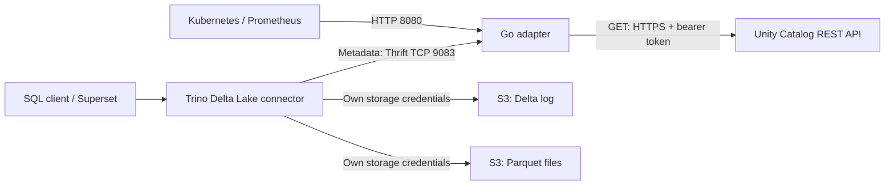

# UC–Trino Metastore Adapter: short teaching walkthrough

**Suggested presentation time: 10–15 minutes.** Based on source commit `5d47e413c439b584bd5a68ca8805982546a50e81`, reviewed 7 October 2026. For the full walkthrough, see [the detailed version](CODE_WALKTHROUGH_DETAILED.md).

## 1. Explain the purpose in one minute

“Trino's Delta Lake connector knows how to ask a Hive Metastore for table metadata. Our catalog is Unity Catalog, which exposes REST APIs. This Go adapter receives the Hive Metastore requests, asks Unity Catalog for schemas and table locations, and translates the answers back into the format Trino expects. Trino then reads the Delta log and data itself.”

Think of the adapter as a translator at a directory desk: it tells Trino where a table lives. It does not deliver the table's rows.



**Current scope:** five read RPCs; external Delta tables on `s3://` or `s3a://`. No adapter database, runtime metadata cache, S3 client, credential vending, writes, end-user impersonation or HMS TLS/SASL. Live Trino SQL acceptance remains pending; the diagram describes the intended integration and implemented adapter boundaries.

## 2. Introduce the vocabulary

| Term | Meaning and use here |
|---|---|
| Metadata | Names, comments, format and location describing data; not the actual rows. |
| Metastore / HMS | Hive Metastore API contract used by Trino to discover schemas and tables. The adapter implements a small part of that contract without running an HMS server. |
| Connector | Trino plugin that understands a source. The Delta Lake connector interprets the Delta log and reads Parquet. |
| Thrift / RPC | Binary protocol and remote procedure calls such as `get_table_req`, sent over TCP. |
| REST / JSON | HTTP API and response format used between the adapter and UC. |
| Catalog / schema / table | Three naming levels. Trino `uc_delta.raw.events` maps to UC `unity.raw.events` when `UC_CATALOG=unity`. |
| Delta log | `_delta_log` records table schema, protocol, transactions and active files; Trino reads it. |
| Parquet | Columnar files holding the table data; Trino reads selected files. |
| Bearer token | Adapter's credential sent to UC in `Authorization: Bearer …`. It is separate from Trino's S3 credentials. |
| Pagination | Fetching multiple UC list pages using `next_page_token`; incomplete lists fail rather than returning partial results. |

## 3. Walk through startup

Open [main.go](../cmd/server/main.go), then follow:

```text
main()
  → config.Load()                         read/validate environment
  → signal.NotifyContext()               cancel on SIGTERM/SIGINT
  → run()
      → observability.NewMetrics()
      → unity.New()                      HTTP client + local token validation
      → thrift.New()                     bind TCP 9083, processor + handler
      → health.Handler() + net.Listen()  bind HTTP 8080
      → start both serving goroutines
      → health.SetReady(true)
```

Readiness proves local initialization and listener binding. It does not make a UC request or prove a working SQL query.

## 4. Teach the request chain

All supported requests pass through this common adapter chain:

```text
Trino's generated Thrift client
  → TCP socket / binary protocol
  → observedProcessor.Process()           method check, deadline, metrics
  → generated method processor            decode arguments
  → Handler method                       choose UC operation
  → unity.Client                         validate, GET, retry, paginate
  → translate function, when needed      UC model → HMS model
  → generated processor                  encode result or declared exception
  → Trino
```

| User operation | HMS wire method | Adapter handler → UC method | REST request |
|---|---|---|---|
| `SHOW SCHEMAS` | `get_all_databases` | `GetAllDatabases` → `ListSchemas` | `GET /schemas?catalog_name=unity&max_results=100` |
| Schema properties | `get_database` | `GetDatabase` → `GetSchema` → `translate.Database` | `GET /schemas/unity.raw` |
| `SHOW TABLES` | `get_table_meta` | `GetTableMeta` → `ListTables` → `translate.TableMeta` | `GET /tables?catalog_name=unity&schema_name=raw&max_results=50` |
| Table lookup for `DESCRIBE` / `SELECT` | `get_table_req` | `GetTableReq` → `GetTable` → UC `GetTable` → `translate.Table` | `GET /tables/unity.raw.events` |
| Compatibility lookup | `get_table` | `GetTable` → UC `GetTable` → `translate.Table` | Same exact table request |

SQL statements can trigger several lookups; Trino caches can reduce repeated calls. This table identifies the relevant methods, not a fixed RPC count per SQL statement.

## 5. Follow one table from SQL to rows

For `SELECT * FROM uc_delta.raw.events`:

1. Trino resolves the table through its Delta/Hive metastore layers and sends a table lookup to the adapter.
2. `Handler.GetTableReq` rejects an explicit HMS catalog name, then delegates to `Handler.GetTable`.
3. `unity.Client.GetTable` requests UC `unity.raw.events` using the configured token.
4. UC identity, table type, format and S3 location are validated. The table must be `EXTERNAL` + `DELTA`.
5. `translate.Table` returns an HMS `EXTERNAL_TABLE` with provider `DELTA` and the location in both `sd.location` and `sd.serdeInfo.parameters["path"]`.
6. Trino uses the path to load `_delta_log`, derive actual columns/partitions and identify active data files.
7. Trino plans work units called splits; workers read selected Parquet files and return rows through Trino to the SQL client.

**Key teaching point:** HMS columns and partition keys are deliberately empty. UC columns do not override the Delta log. `DESCRIBE` therefore also requires Trino to read a valid Delta log.

## 6. Explain connectivity and credentials

Trino catalog file `uc_delta.properties`:

```properties
connector.name=delta_lake
hive.metastore.uri=thrift://uc-trino-metastore:9083
hive.metastore.thrift.impersonation.enabled=false
delta.metastore.store-table-metadata=false
delta.security=READ_ONLY
```

Leave `hive.metastore.thrift.catalog-name` and `delta.hive-catalog-name` unset. Preserve the deployment's Trino governance and S3 configuration.

Adapter configuration:

```text
UC_BASE_URL=https://uc.example/api/2.1/unity-catalog
UC_CATALOG=unity
UC_TOKEN_FILE=/absolute/path/to/uc-token
THRIFT_ADDR=:9083
HTTP_ADDR=:8080
```

Supply exactly one of `UC_TOKEN` or `UC_TOKEN_FILE`. The token must already be provisioned securely. The Kubernetes manifest uses `UC_TOKEN` from a Secret; file configuration is an alternative.

| Connection | What it requires |
|---|---|
| SQL client → Trino | Existing Trino URL, authentication and permissions. |
| Trino → adapter | Reachable service DNS/TCP 9083; currently plain binary Thrift. |
| Adapter → UC | Reachable API URL, valid TLS certificate and authorized UC bearer token. |
| Trino → S3 | Independent storage connectivity and storage credentials. |
| Monitoring → adapter | HTTP 8080 for health, metrics and version. |

## 7. Describe failure behavior

The adapter retries transport errors and HTTP `429`, `500`, `502`, `503`, `504` within a deadline. It does not retry every error. Defaults are 1 second to connect, 3 seconds per HTTP attempt and 10 seconds for the operation.

Authentication, authorization, corrupt responses, pagination failures and outages return errors. A confirmed object-specific UC 404 can become HMS `NoSuchObjectException`; a generic proxy/catalog 404 is not proof that a table is absent. Unsupported RPCs return `UNKNOWN_METHOD`.

## 8. Close with a demo and code tour

Suggested code-opening order:

1. [main.go](../cmd/server/main.go): wiring and lifecycle.
2. [server.go](../internal/thrift/server.go): wire protocol and dispatch.
3. [handler.go](../internal/thrift/handler.go): five RPC implementations.
4. [tables.go](../internal/unity/tables.go): UC lookup and eligibility.
5. [client.go](../internal/unity/client.go): HTTP, credentials, retries.
6. [table.go](../internal/translate/table.go): minimal HMS response.

When the integration environment is available, demonstrate in this order:

```sql
SHOW SCHEMAS FROM uc_delta;
SHOW TABLES FROM uc_delta.raw;
DESCRIBE uc_delta.raw.events;
SELECT * FROM uc_delta.raw.events LIMIT 10;
```

Use a real fixture table with a supported Delta log and working Trino storage credentials. These are proposed runtime acceptance steps, not results already demonstrated by this repository.

Final spoken sentence: “Unity Catalog supplies the table identity and location; the adapter translates the metadata protocol; Trino understands Delta and reads the data.”
