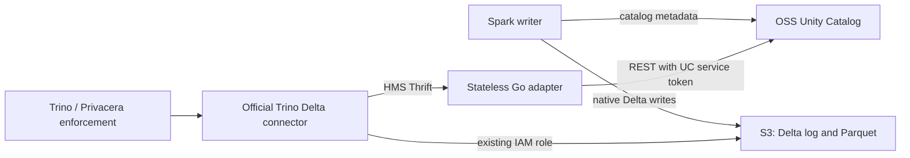

# Source-verified implementation plan

Status: **approved; Milestone 3 table discovery implemented; live Trino acceptance pending**. See [Milestone 3 report](MILESTONE_3.md). See [Milestone 1 scope and deviations](MILESTONE_1.md). Milestone 1 was limited to infrastructure; Milestone 2 added schema reads; Milestone 3 adds the approved table reads and external Delta mapping. Writes and optional RPCs remain unsupported. Review date: 2026-09-25. Source-derived findings are not a claim of an executed integration test. The original source review made no production changes; the subsequent Milestone 1 implementation is recorded separately.

## Decision and architecture validation

The selected design is viable in the inspected **Trino 472** sources for eligible external Delta tables: the official Delta connector already obtains table identity/location through an HMS-compatible boundary, then reads native Delta and Parquet itself. No source-level need for a Trino fork, Hive Metastore service, HMS database, Iceberg, UniForm or an adapter Delta parser was found. UC remains authoritative for namespace, format and location; `_delta_log` remains authoritative for Delta schema, partitions, protocol and snapshots. [T-wrapper](https://github.com/trinodb/trino/blob/472/plugin/trino-delta-lake/src/main/java/io/trino/plugin/deltalake/metastore/HiveMetastoreBackedDeltaLakeMetastore.java) [T-metadata](https://github.com/trinodb/trino/blob/472/plugin/trino-delta-lake/src/main/java/io/trino/plugin/deltalake/DeltaLakeMetadata.java) [T-log](https://github.com/trinodb/trino/blob/472/plugin/trino-delta-lake/src/main/java/io/trino/plugin/deltalake/transactionlog/TransactionLogAccess.java) [T-pages](https://github.com/trinodb/trino/blob/472/plugin/trino-delta-lake/src/main/java/io/trino/plugin/deltalake/DeltaLakePageSourceProvider.java)

Architecture validation is conditional on the runtime gates below: deployed Privacera behavior, Spark's actual catalog configuration, exact table feature compatibility and a successful complete test run with old HMS stopped or blocked. Adapter mutation rejection alone cannot enforce read-only Trino because native Delta writes can go straight to S3.

## Review artifacts

- [TRINO_CALL_FLOW.md](TRINO_CALL_FLOW.md): 13 requested operation traces, shared method chains, data path and caller error limitations.
- [RPC_MATRIX.md](RPC_MATRIX.md): exact minimum versus compatibility RPCs, explicit write rejection and wire errors.
- [UC_HMS_MAPPING.md](UC_HMS_MAPPING.md): source/API contract and field-by-field response design.
- [TEST_PLAN.md](TEST_PLAN.md): executable acceptance criteria to implement after approval.
- [RISKS_AND_OPEN_QUESTIONS.md](RISKS_AND_OPEN_QUESTIONS.md): blockers, user decisions and certification gaps.

Repository review covered every non-git file present before changes. `Agents.md` exists but is empty (case differs from requested AGENTS.md); README, ARCHITECTURE, RPC_MATRIX, TEST_PLAN and RUNBOOK were empty. UC_HMS_MAPPING was absent. CODEX_HANDOFF and the existing Go skeleton were read. The handoff is architectural intent, not proof; corrections are recorded in its verification addendum. Production placeholders and go.mod were unchanged during that review; Milestone 1 subsequently updated them as recorded in its report.

## Initial runtime profile

Use the existing POC stack unchanged: Trino 472, Spark 3.5.9/Scala 2.12, Delta 3.3.2, UC 0.5.1, UC Spark connector/client 0.2.1, existing S3 locations and existing Trino IAM role. This review does not independently certify the Spark/client binary combination. Do not enable coordinated commits, managed catalog-owned semantics or other new writer features during migration.

One adapter deployment maps to one UC catalog. Expose external Delta only. No cross-catalog flattening, views, managed tables, user impersonation or credential vending in phase 1. Trino uses TCP `thrift://adapter:9083`, not the HTTP metastore client. Set `hive.metastore.thrift.impersonation.enabled=false`; leave `hive.metastore.thrift.catalog-name` and `delta.hive-catalog-name` unset. Explicitly set `delta.metastore.store-table-metadata=false` (472 default false). [T-client-factory](https://github.com/trinodb/trino/blob/472/plugin/trino-hive/src/main/java/io/trino/plugin/hive/metastore/thrift/DefaultThriftMetastoreClientFactory.java) [T-thrift-config](https://github.com/trinodb/trino/blob/472/plugin/trino-hive/src/main/java/io/trino/plugin/hive/metastore/thrift/ThriftMetastoreConfig.java) [T-config](https://github.com/trinodb/trino/blob/472/plugin/trino-delta-lake/src/main/java/io/trino/plugin/deltalake/DeltaLakeConfig.java)

Enforce read-only at Trino access control, retaining Privacera. `delta.security=READ_ONLY` is the built-in connector option, but whether it composes correctly with the installed governance plugin must be tested; `SYSTEM` uses system security/roles and requires equivalent explicit deny policy. Do not replace Privacera to simplify the POC. Test INSERT/UPDATE/DELETE/MERGE, DDL, ANALYZE, procedures, table EXECUTE and catalog session-property changes. S3 IAM should prevent unintended writes where the existing policy permits that tightening. [T-security](https://github.com/trinodb/trino/blob/472/plugin/trino-delta-lake/src/main/java/io/trino/plugin/deltalake/DeltaLakeSecurityModule.java) [T-metadata](https://github.com/trinodb/trino/blob/472/plugin/trino-delta-lake/src/main/java/io/trino/plugin/deltalake/DeltaLakeMetadata.java)

## Go Thrift strategy

1. Vendor the exact upstream `trinodb/hive-thrift` **tag 2** IDL with license/provenance and digest. Trino 472 POM uses `io.trino.hive:hive-thrift:2`; that artifact uses Java libthrift 0.19.0. This is the exact client wire source, not an instruction to generate Hive 3.1.3's entire API. [T-pom](https://github.com/trinodb/trino/blob/472/pom.xml) [H-pom](https://github.com/trinodb/hive-thrift/blob/2/pom.xml) [H2](https://github.com/trinodb/hive-thrift/blob/2/src/main/thrift/hive_metastore.thrift)
2. Generate Go via the Apache Thrift compiler and matching Go runtime. Candidate to validate: compiler/runtime **0.22.0** together; this review inspected its Go server implementation, not a compiled artifact. Pin compiler image digest/runtime module/checksums after the contract spike, and review maintained/security-patched versions before production. Do not change the existing Go 1.22 directive without selecting and testing the implementation toolchain.
3. Keep upstream IDL untouched. Derive a reviewed adapter service projection containing the five selected read methods plus their unchanged transitive type/exception declarations. Preserve **wire method names, field IDs, primitive/container types, requiredness, defaults and exception IDs**. A Go namespace/package annotation may differ because it is not on the wire. Check the projection mechanically against upstream; never hand-edit generated Go. This prevents hundreds of handwritten unused handler methods. No custom RPC codec.
4. Generate into `internal/thrift/generated/` only when implementing. Reproducible generation should be a build/CI step with a zero-diff check; choose whether generated files are committed in that milestone, document the choice, and preserve license headers. Unknown methods must get a Thrift application exception, never a zero-valued successful result.
5. Test against the **actual Trino Java generated client/conversion code**, not only a Go client generated from the same reduced IDL. The same field IDs/types make Go/Java wire compatibility plausible by construction, but interoperability is **not yet executed or certified**. Acceptance includes empty-list encoding, request capabilities, unknown optional fields, result-union exceptions, fallback reconnect and request sequence IDs.

### Transport, connections and concurrency

Trino's client constructs `TBinaryProtocol`; TCP factory `Transport.createRaw` uses `TSocket`, optionally wrapped in TLS/authentication. Initial deployment is unframed binary TCP, no SASL/Kerberos, no THeader, no compact protocol and no HTTP endpoint. Buffered I/O is fine; framed transport is not interchangeable. [T-client](https://github.com/trinodb/trino/blob/472/plugin/trino-hive/src/main/java/io/trino/plugin/hive/metastore/thrift/ThriftHiveMetastoreClient.java) [T-transport](https://github.com/trinodb/trino/blob/472/plugin/trino-hive/src/main/java/io/trino/plugin/hive/metastore/thrift/Transport.java)

Use Apache Go `TSimpleServer` as the initial server primitive: despite its name it starts concurrent goroutines per accepted connection and loops requests serially on each connection. Never share protocol state between sockets or concurrently write replies on one connection. Enforce connection count, idle/read/write deadlines, RPC admission concurrency, body/message sizes and UC in-flight request bounds. The library's server alone is not a bounded worker pool. Trino's metastore methods ordinarily create/close a client per attempt; `alternativeCall` can reconnect. Support multiple calls per socket anyway. [Go-server](https://github.com/apache/thrift/blob/v0.22.0/lib/go/thrift/simple_server.go) [T-thrift](https://github.com/trinodb/trino/blob/472/plugin/trino-hive/src/main/java/io/trino/plugin/hive/metastore/thrift/ThriftHiveMetastore.java) [T-client](https://github.com/trinodb/trino/blob/472/plugin/trino-hive/src/main/java/io/trino/plugin/hive/metastore/thrift/ThriftHiveMetastoreClient.java)

SIGTERM: mark unready, stop accepting, allow active requests to finish within the drain budget, cancel remaining UC contexts, close sockets, flush telemetry and exit. The reviewed Go server has `ServerStopTimeout=0` by default (potential indefinite waiting); set/test a finite stop timeout and bounded HTTP shutdown. Use Kubernetes termination grace longer than drain. Do not rely on an uncancelled `context.Background` as an RPC deadline. [Go-server](https://github.com/apache/thrift/blob/v0.22.0/lib/go/thrift/simple_server.go)

## Exact package responsibilities

No repository interfaces, generic transport frameworks, plugin systems or empty domain abstractions are needed. Start with concrete types and extract a narrow interface only where a real test/caller needs one.

| Package/path | Concrete responsibility once approved | Explicit boundary |
|---|---|---|
| `cmd/server` | Load validated configuration; wire UC client, handlers, server and telemetry; signals/shutdown | No translation/business logic |
| `internal/config` | One typed config struct, environment/file parsing and cross-field validation; secret file path, not secret logging | Fail startup on invalid required settings |
| `internal/thrift` | Binary TCP lifecycle, generated processor integration, five RPC handlers, unsupported dispatch, admission/deadlines and error mapping to declared results | No S3 access and no general HMS implementation |
| `internal/thrift/generated` | Compiler-owned contract types/processors | No manual edits |
| `internal/unity` | Concrete HTTP client; small local UC response structs; schema/table GET/list; token loading, bounded paging/retries; typed upstream error categories | No HMS types; no mutation methods |
| `internal/translate` | Pure SchemaInfo→Database, TableInfo→Table/TableMeta, eligibility and structural validation | No I/O, no Delta/type parser in phase 1 |
| `internal/cache` | Only after measurements: bounded in-memory metadata cache | Remain placeholder while cache disabled; no shared persistent state |
| `internal/observability` | Structured logger, bounded-cardinality Prometheus metrics, OpenTelemetry spans, health HTTP server | No token/payload export |
| `integration` | JVM wire consumer, golden fixtures, Trino/UC/Spark/Superset scenarios and fault harness | Existing HMS is an oracle only before final isolation gate |
| `deploy/kubernetes` | Deployment/Service/config/secret references, probes, NetworkPolicy, disruption/rolling settings | No HMS deployment, no adapter PVC/database |

Retain the approved skeleton. Add files according to implemented responsibilities, not every speculative handoff filename. No `fields.go` until get_fields is justified, no cache API until caching is implemented, and no Helm chart in the initial scope.

## Configuration and UC client

Proposed adapter settings below are design choices, not existing supported environment variables or upstream guarantees. Freeze their public names during implementation review.

| Setting group | Proposed values / behavior |
|---|---|
| Required namespace/auth | `UC_BASE_URL`, `UC_CATALOG`, `UC_TOKEN_FILE`; TLS verified; plaintext UC permitted only in explicitly isolated local POC |
| Listeners | `THRIFT_ADDRESS=:9083`, separate `HTTP_ADDRESS=:8081`; TLS certificate/key paths if TLS termination is in process |
| Initial deadlines | UC connect 1s, individual HTTP request 3s, entire RPC/pagination 10s; Trino read timeout must exceed RPC budget. Benchmark and adjust for large catalogs |
| Retries | At most 2 UC attempts per GET initially; jittered delay starting near 100ms, capped by remaining RPC budget; Retry-After honored only within budget |
| Pagination | schema page 100, table page 50; explicit page/entry/response-byte limits and repeated-token detection; fail rather than truncate |
| Admission limits | Finite configurable connections and simultaneous RPC/UC requests; size from load test, expose rejection metrics |
| Cache | Disabled initially (`TTL=0`); any later positive TTL/max-entries must be explicit and tested |
| Shutdown | Initial drain 15s; Kubernetes grace at least 30s; validate against largest supported RPC budget |
| Telemetry | Log level, OTLP destination, sampling fraction; health/metrics access restricted |

Use one shared `net/http.Client` and pooled Transport. Per-RPC contexts contain the total budget across pages and retries. Always close response bodies; cap decoded body size; verify HTTP status before decoding. Disallow credential-bearing redirects to other origins (prefer no redirects). Do not log response bodies. Read bearer credentials from a mounted, rotatable file; load atomically and avoid retaining secrets in errors. Do not build a generic OAuth provider hierarchy.

UC API response structs only need fields consumed by this contract, while preserving enough presence information to distinguish missing/invalid identity/location from an empty valid list. Unknown JSON fields are additive-compatible; malformed required fields are not. All error translation is centralized by category and implemented per RPC's declared exception union. See [mapping](UC_HMS_MAPPING.md) and [errors](RPC_MATRIX.md#wire-error-contract).

Pagination aggregates all pages before replying. Continue through empty filtered pages while a next token exists. Enforce token progress, deadline and size bounds. A failing page fails the whole result; never cache partial lists. Cross-page consistency under concurrent rename/create/drop is best-effort UC enumeration, not a transactional snapshot. Define deterministic duplicate handling and reject conflicting duplicate metadata; test it.

Retry only safe GET failures: throttling and transient availability/transport failures. No retries for 401/403, ordinary not-found, validation, malformed responses or unsupported formats. Trino adds its own retry loop and may attempt both table RPCs, so tune **end-to-end** attempt/latency bounds rather than multiplying defaults. No speculative circuit breaker in the first build; bounded admission and observable backoff first.

## Caching, observability and health

Start without adapter caching; Trino already has metastore/transaction-log caches. If required by measured load, add bounded process-local TTL caching keyed by UC endpoint/catalog/service-identity scope plus schema/table. Cache only fully successful namespace/identity/location results. No auth errors, partial results, outage masking, persistent cache, or Delta versions/schema/active files. Negative caching stays disabled initially. Declare freshness as combined adapter and Trino TTLs; a pod restart is safe and never loses authoritative metadata. [T-factory](https://github.com/trinodb/trino/blob/472/plugin/trino-delta-lake/src/main/java/io/trino/plugin/deltalake/DeltaLakeMetadataFactory.java)

Metrics: RPC count/latency/in-flight by bounded RPC/status labels; UC request latency/status/retries/timeouts by route template; pagination page/entry counts, unsupported methods, invalid metadata, admission rejection, cache hit/miss/eviction when enabled. Never use table names, users, locations or arbitrary unknown method strings as labels. Structured logs include local request ID, RPC, duration and safe error category. JWTs, credentials and upstream stack traces are excluded.

OpenTelemetry starts a local span at each Thrift RPC and children for UC calls/pages/retries. Plain HMS binary protocol carries no W3C trace context, so do not claim an automatically continuous Trino trace. External correlation needs separately instrumented Trino/plugin support; local request IDs and timestamps are the initial diagnostic bridge.

`/livez`: process event-loop health only. `/readyz`: valid initialization, loaded credentials, listening and not draining. `/health/dependencies`: bounded/cached UC reachability/auth diagnostic, separate from liveness to avoid restart storms during outages. `/metrics`: Prometheus. Decide whether sustained UC authentication failure should remove readiness; all requests still fail closed regardless.

## Security and deployment

UC sees the adapter's service identity, not the Trino end user. Token must be acceptable to UC v0.5.1's INTERNAL-issuer verifier, and the principal must be enabled/granted. Do not assume a generic external OIDC JWT works against table endpoints. setUGI is not authentication or secure delegation. [U-auth](https://github.com/unitycatalog/unitycatalog/blob/v0.5.1/server/src/main/java/io/unitycatalog/server/service/AuthDecorator.java) [U-server](https://github.com/unitycatalog/unitycatalog/blob/v0.5.1/server/src/main/java/io/unitycatalog/server/UnityCatalogServer.java) [U-authz](https://github.com/unitycatalog/unitycatalog/blob/v0.5.1/server/src/main/java/io/unitycatalog/server/auth/AuthorizeExpressions.java)

Permit Thrift access only from authorized Trino nodes; permit adapter egress only to UC and required DNS/telemetry. Adapter needs neither S3 IAM nor Delta/Parquet access. Preserve existing Trino/Privacera policy checks, masking and filtering through real tests. With a shared UC identity, direct adapter access reveals the service-visible namespace: network isolation/TLS and governance review are required. Pin CA validation and token rotation; choose TLS/mTLS termination based on the actual client setup. Trino's TCP transport can use an SSLContext, but the complete deployment handshake must be tested. [T-transport](https://github.com/trinodb/trino/blob/472/plugin/trino-hive/src/main/java/io/trino/plugin/hive/metastore/thrift/Transport.java)

Production: at least two replicas, anti-affinity/topology spread, resource limits, PDB, rolling maxUnavailable=0 where capacity permits, termination drain, secret mounts, restricted metrics, no local authoritative state. Load-balance new connections through a Kubernetes Service; test long-lived connections during rollout. Rollback changes Trino catalog/Superset routing; it never moves data. Old HMS is a temporary migration oracle/rollback option, never a final dependency.

## Trino 472 versus current production candidate 483

The official [Trino download page](https://trino.io/download) identifies **483** as current at review time. Recommend evaluating 483 for production; keep 472 as the implementation/POC target until explicitly approved. A current version is a candidate, not automatic certification for Privacera, Java, plugins or the writer stack.

| Source comparison | Verified difference | Adapter implication |
|---|---|---|
| `DeltaLakeMetastore.java` | Identical across inspected tags | Same metastore read interface |
| `HiveMetastoreBackedDeltaLakeMetastore.java` | Read forwarding/provider/path rules retained; replaceTable passes extra map; DeltaMetastoreTable gains catalogOwned=false | Synthesized read mapping unchanged; extra mutation argument irrelevant to allowed operations |
| `DeltaLakeMetadata.java` | Credentials/transaction-log reader plumbing added; table descriptor/snapshot handling reworked. Bulk `streamTableColumns` replaced by explicit `streamRelationColumns`; obsolete method throws. Table read still starts with raw metastore table/provider/path | Same core RPC set, but column-discovery sequencing/load and native reader behavior need new tests; do not claim identical query execution |
| `ThriftHiveMetastoreClient.java` | Removes metastoreSupportsTableMeta switch and get_tables/get_tables_by_type alternate branch. Retains get_table_req/get_table alternatives, catalog name encoding and binary protocol. Also fixes catalog prefix in transactional alter fallback | get_table_meta remains required. No need to add obsolete alternate list methods for 483 |
| POM / Hive Thrift | Artifact **2 → 3**. IDL diff adds Timestamp/TimestampColumnStatsData and union field 8 timestampStats only | Initial five RPC field/exception shapes unchanged; Hive stats extension irrelevant while stats RPC is unsupported |
| Read metadata write-back | store-table-metadata default remains false | Continue explicit false setting |

Comparison sources: [483 interface](https://github.com/trinodb/trino/blob/483/plugin/trino-delta-lake/src/main/java/io/trino/plugin/deltalake/metastore/DeltaLakeMetastore.java), [483 wrapper](https://github.com/trinodb/trino/blob/483/plugin/trino-delta-lake/src/main/java/io/trino/plugin/deltalake/metastore/HiveMetastoreBackedDeltaLakeMetastore.java), [483 metadata](https://github.com/trinodb/trino/blob/483/plugin/trino-delta-lake/src/main/java/io/trino/plugin/deltalake/DeltaLakeMetadata.java), [483 client](https://github.com/trinodb/trino/blob/483/plugin/trino-hive/src/main/java/io/trino/plugin/hive/metastore/thrift/ThriftHiveMetastoreClient.java), [483 POM](https://github.com/trinodb/trino/blob/483/pom.xml), [H2](https://github.com/trinodb/hive-thrift/blob/2/src/main/thrift/hive_metastore.thrift), [H3](https://github.com/trinodb/hive-thrift/blob/3/src/main/thrift/hive_metastore.thrift). The corresponding 472 sources are linked throughout this plan.

## Milestones and exit gates

| Stage | Authorized only after plan approval | Exit evidence |
|---|---|---|
| P0: contract spike | Pin compiler/Go/IDL projection; generated five-method service and JVM consumer fixtures | Java clients from 472 and 483 decode success/errors; Trino conversion accepts empty columns; generation reproducible |
| P1: minimal service | Lifecycle, UC client/auth, five read handlers, paging/error contract, health/metrics; no cache | Unit/translation/wire tests pass; every mutation/unknown method fails; no upstream write client |
| P2: local native Delta | Real UC + Spark fixture + unmodified Trino 472, existing data locations | SHOW/DESCRIBE/SHOW CREATE/info-schema/SELECT/count/pruning pass with HMS blocked; Spark N+1 visible |
| P3: discovery and governance | Deployed Superset driver/plugin version trace, Privacera policy tests, failure injection | No missing RPCs; identity/policy equivalence and documented caller error behavior |
| P4: EKS POC | Parallel read catalogs, real S3 IAM and token rotation, representative datasets | Matching query results/schema; adapter path produces zero old-HMS traffic |
| R1: production certification | Certify 483 separately, protocol/features, security/CA/SBOM, load/SLOs | Supported matrix signed off, no unclassified RPCs or Delta features |
| R2: operations | HA, rolling deployment, fault/concurrency/load, dashboards/alerts and full runbook | Meets agreed latency/freshness/error budgets, bounded resources/retries, rollback drill passes |
| R3: canary/retirement | Superset canary → gradual traffic → HMS isolation observation → decommission | Complete suite with old HMS stopped/blocked, zero old-HMS/DB dependencies for both Spark and Trino, agreed observation window |

The owner approved Milestone 1 infrastructure and subsequently authorized Milestone 2 schema discovery, then deferred Trino integration testing. Milestone 3 table reads are subsequently implemented within the approved five-RPC contract; live acceptance remains pending. Subsequent stages remain subject to their gates and the decisions in [RISKS_AND_OPEN_QUESTIONS.md](RISKS_AND_OPEN_QUESTIONS.md).

## Evidence provenance

Primary source archives inspected: `trinodb/trino` tags 472 and 483; `unitycatalog/unitycatalog` v0.5.1; `trinodb/hive-thrift` 2 and 3. Related inspected files include engine SHOW rewrite, information-schema page source, MetadataManager/ConnectorMetadata, bridging/conversion, view helper, factories/transport/UGI, retry driver, Delta config/scheduler/split/page-source/statistics/log/features, UC services/repositories/pagination/auth/error handlers. Linked reference Superset/driver sources are not assertions about the user's deployed versions.

No live Trino, UC, HMS, Spark, Superset or Privacera environment was supplied or exercised. Go was absent from this environment during skeleton creation; no generated Go compilation or wire test has been run. Test procedures in this plan are future acceptance gates, not pass claims.

### Inspected source fingerprints (SHA-256)

| Source | SHA-256 |
|---|---|
| Trino 472 `DeltaLakeMetastore.java` | `acb865f0411c5f06cd420569ca0cb546f6d9093edbcd102c300291530f626708` |
| Trino 472 `HiveMetastoreBackedDeltaLakeMetastore.java` | `377f8798173044b202ad05d97b2d116a2eae65cc16df74203b9a090be9008641` |
| Trino 472 `DeltaLakeMetadata.java` | `26d3c17692df76844909fa51c5f891e394e41a04489e43bbcd18b7ef0f12e8fd` |
| Trino 472 `ThriftHiveMetastoreClient.java` | `35c41c4e05e9be7ba9c3b7ace55980642bc5cfbb63e0e889a546b1226d8dd59b` |
| Trino 483 `DeltaLakeMetastore.java` | `acb865f0411c5f06cd420569ca0cb546f6d9093edbcd102c300291530f626708` |
| Trino 483 `HiveMetastoreBackedDeltaLakeMetastore.java` | `0aecb871469e1346954fab6ae2b72a7390fa9f9044aa23680770e3e0920b2712` |
| Trino 483 `DeltaLakeMetadata.java` | `7edc1a792a9eb86f31d13a3487d72e05d8856c55c2d2c4775d7a9eddc8a3bca9` |
| Trino 483 `ThriftHiveMetastoreClient.java` | `ba56b53ed010a7d8eeb9e7608309e53d01192ea67de8981eb110a23709ae59f6` |
| `unitycatalog-0.5.1/api/all.yaml` | `fcc31cda30fc4590edd1680dd219da814b4ff7d662acad99d7cee3b208a342cb` |
| `hive-thrift-2/src/main/thrift/hive_metastore.thrift` | `b4a4be314077eeafe487d2c004d7dcea949141a2f716dd86ff01c00e58651575` |
| `hive-thrift-3/src/main/thrift/hive_metastore.thrift` | `5c33e3fe5e98d322c12cbef0a54d02a67f972ce3d88294c06c1211a4e2101fe2` |
